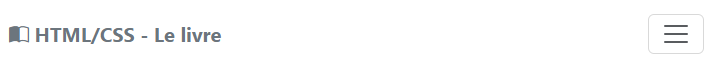
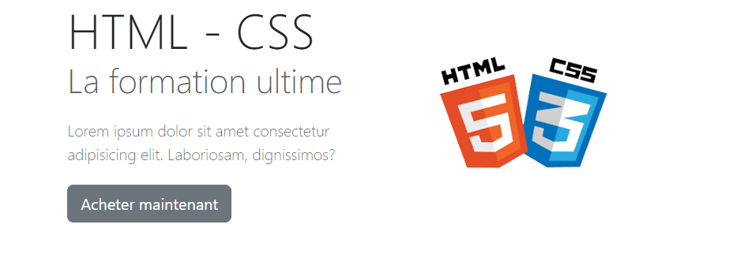
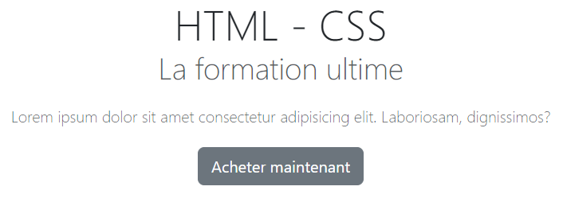
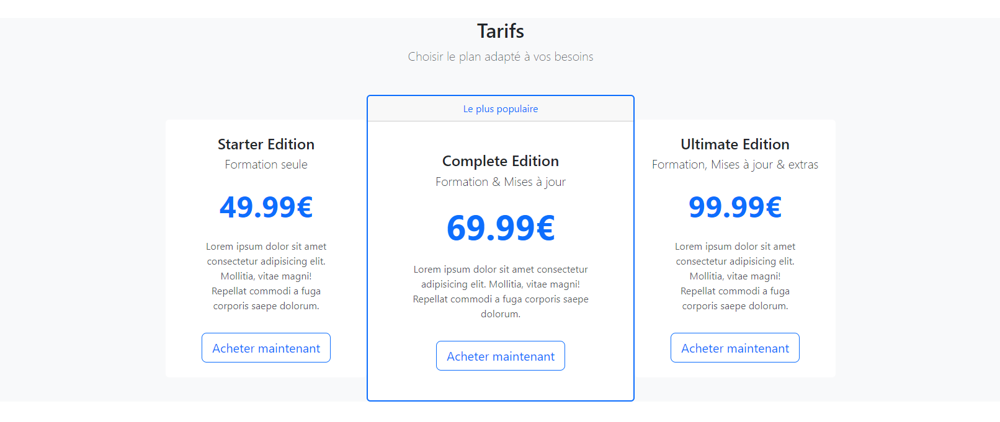
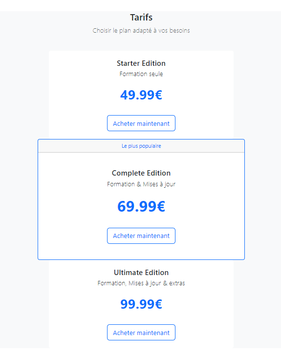
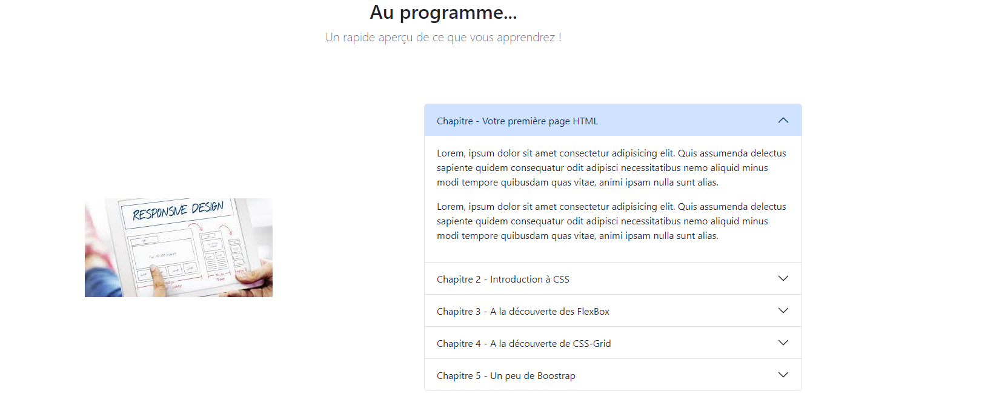
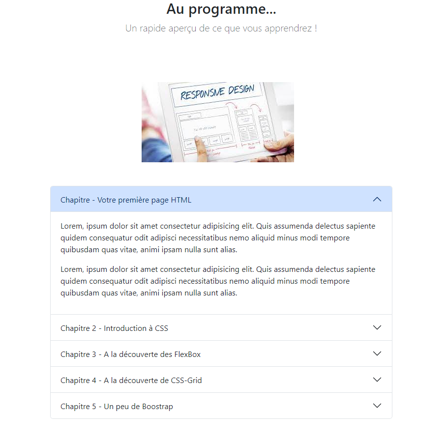
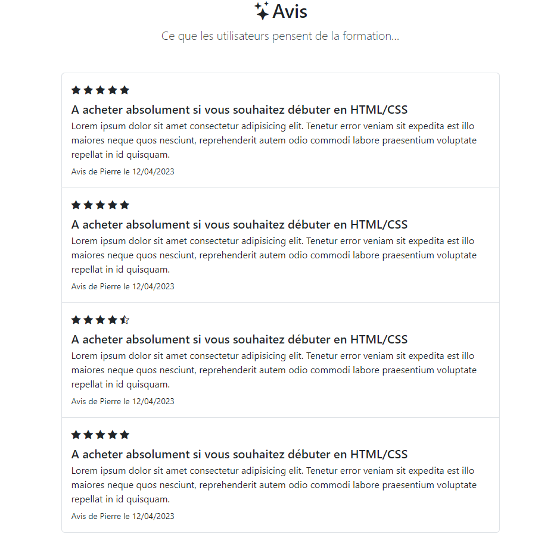
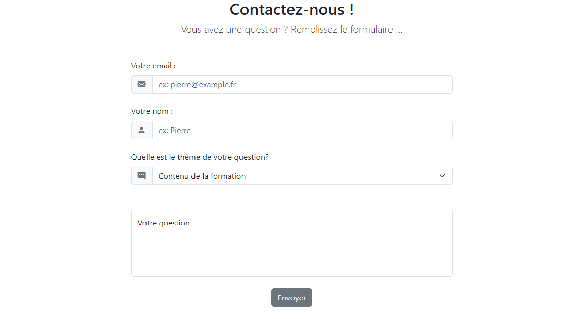

# Cahier des charges

L'objectif est de construire une page Web permettant de promouvoir et vendre une formation en ligne.

## Partie menu

Voici le lien vers le fichier HTML : [menu.html](../parties/menu.html)

### Objectif

Cette partie permet de présenter le menu de la page.

### Maquette

Vous trouverez ci-dessous la maquette attendue :

Afin de rendre cette page responsive, vous utiliserez le breakpoint **md** afin d'avoir l'affichage ci-dessous pour des
résolutions < 768px :   

## Présentation de la formation

Voici le lien vers le fichier HTML : [presentation.html](../parties/presentation.html)

### Objectif

Cette partie permet de présenter brièvement la formation.

### Maquette

Vous trouverez ci-dessous la maquette attendue :

Afin de rendre cette page responsive, vous utiliserez le breakpoint **md** afin d'avoir l'affichage ci-dessous pour des
résolutions < 768px :

## Les plans tarifaires

Voici le lien vers le fichier HTML : [tarifs.html](../parties/tarifs.html)

### Objectif

Cette partie permet de présenter les différents tarifs de la formation.   
Chaque plan tarifaire est représenté par une **Card**.   
Vous remarquerez la mise en évidence du tarif correspondant à la "Complete Edition".   
Voici le lien vers la documentation : [Documentation card](https://getbootstrap.com/docs/5.3/components/card/)

### Maquette

Vous trouverez ci-dessous la maquette attendue :

Afin de rendre cette page responsive, vous utiliserez le breakpoint **lg** afin d'avoir l'affichage ci-dessous pour des
résolutions < 992px :

## Contenu de la formation (A propos de la formation)

Voici le lien vers le fichier HTML : [contenu.html](../parties/contenu.html)

### Objectif

Cette partie permet de présenter le contenu de la formation.   
Le composant Boostrap utilisé est un **Accordion**.   
Voici le lien vers la documentation : [Documentation accordion](https://getbootstrap.com/docs/5.3/components/accordion/)

### Maquette

Vous trouverez ci-dessous la maquette attendue :

Afin de rendre cette page responsive, vous utiliserez le breakpoint **lg** afin d'avoir l'affichage ci-dessous pour des
résolutions < 992px :

## Avis des utilisateurs

Voici le lien vers le fichier HTML : [avis.html](../parties/avis.html)

### Objectif

Cette partie permet de présenter les avis des utilisateurs ayant déjà acheté la formation.   
Le composant Boostrap utilisé est un **List Group**.   
Voici le lien vers la
documentation : [Documentation List Group](https://getbootstrap.com/docs/5.3/components/list-group/)

### Maquette

Vous trouverez ci-dessous la maquette attendue :

## Formulaire de contact

Voici le lien vers le fichier HTML : [contact.html](../parties/contenu.html)

### Objectif

Cette partie permet aux utilisateurs de contacter le site afin de formuler une question.   
Le composant Boostrap utilisé est un **Form**.   
Voici le lien vers la
documentation : [Documentation Form](https://getbootstrap.com/docs/5.3/forms/overview/)

### Maquette

Vous trouverez ci-dessous la maquette attendue :

